# ⭐ MovieRatings Analytics Pipeline
### Arquitectura Medallion en Azure Databricks

[](https://databricks.com/)
[](https://azure.microsoft.com/)
[](https://spark.apache.org/)
[](https://delta.io/)
[](https://powerbi.microsoft.com/)
[](https://github.com/features/actions)

*Pipeline automatizado de datos para análisis de peliculas por rating con arquitectura de tres capas y despliegue continuo*

</div>

## 🎯 Descripción

📄 MovieRatings Analytics Pipeline es un proyecto de ingeniería de datos que implementa un flujo ETL completo en Databricks para procesar la información de películas y calificaciones de usuarios.
Los archivos movies.csv y ratings.csv se ingieren en el conetenedor Raw y se cargan en el nivel Bronze, se limpian y transforman en Silver, y luego se modelan en tablas Golden listas para análisis avanzado.

Se han creado 2 areas: de desarrollo y de trabajo. En el  area de desarrollo se crea la logica y un archivo yaml que apunta a la rama construccion del repositorio del proyecto en github. Cuando se hace un pull request de "construccion" -> "main", el archivo yaml carga los notebooks al area de produccion. Asi tambien ejecuta un WorkFlow que realiza el proceso ETL de nuestro proyecto.

El proyecto incluye la utilizacion del entorno de desarrollo y produccion, eliminacion de columnas duplicadas, enriquecimiento de datos (años, géneros, complejidad), categorización de ratings y creación de métricas agregadas, permitiendo habilitar dashboards en Power BI y análisis de machine learning basados en preferencias de usuarios y características de películas.

### ▶️ WorkFlow en produccion:

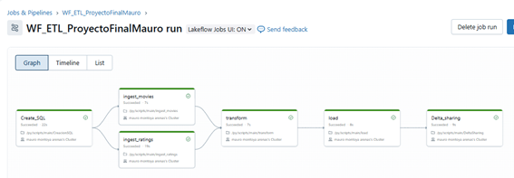

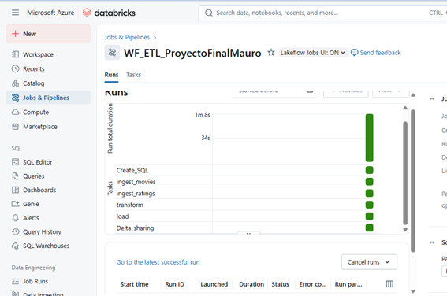


### ✨ Características Principales

- 🔄 **ETL Automatizado** - Pipeline completo con despliegue automático via GitHub Actions
- 🏗️ **Arquitectura Medallion** - Separación clara de capas Bronze → Silver → Gold
- 📊 **Modelo Dimensional** - Star Schema optimizado para análisis de negocio
- 🚀 **CI/CD Integrado** - Deploy automático en cada push a master
- 📈 **Power BI Ready** - Conexión directa con SQL Warehouse
- ⚡ **Delta Lake** - ACID transactions y time travel capabilities

## 🏛️ Arquitectura

### ➡️ Flujo de Datos

```
📄 CSV (Raw Data)
    ↓
🛢️ Raw (contenedor)
    ↓
🥉 Bronze Layer (Ingesta sin transformación)
    ↓
🥈 Silver Layer (Limpieza + Modelo Dimensional)
    ↓
🥇 Gold Layer (Agregaciones de Negocio)
    ↓
📊 Power BI (Visualización)
```

### 📦 Capas del Pipeline

<table>
<tr>
<td width="33%" valign="top">

#### 🥉 Bronze Layer  
**Propósito**: Zona de aterrizaje  

**Tablas**:  
- `movies`  
- `ratings`  

**Características**:  
- ✅ Datos tal cual vienen del CSV  
- ✅ Timestamp de ingesta (`ingestion_date`)  
- ✅ Sin transformaciones ni validaciones  
- ✅ Preserva estructura original  

</td>
<td width="33%" valign="top">

#### 🥈 Silver Layer  
**Propósito**: Limpieza y enriquecimiento  

**Tablas**:  
- `movies_ratings_silver`

**Características**:  
- ✅ Normalización de columnas  
- ✅ Eliminación de duplicados (ej.: `movieId` repetido)  
- ✅ Columnas derivadas (`year`, `title_clean`, `rating_date`)  
- ✅ UDFs para clasificaciones (`rating_categoria`, `complejidad_genero`)  
- ✅ Join entre movies y ratings para construir dataset unificado  

</td>
<td width="33%" valign="top">

#### 🥇 Gold Layer  
**Propósito**: Analytics-ready  

**Tablas**:  
- `movies_insights`  

**Características**:  
- ✅ Pre-agregados (ej.: años de antigüedad, métricas por película)  
- ✅ Listo para BI (Power BI, dashboards)  
- ✅ Optimizado para performance  
- ✅ KPIs y métricas listas para análisis avanzado  

</td>
</tr>
</table>


---

## 📁 Estructura del Proyecto

```
coffee-shop-etl/
│
├── 📂 .github/
│   └── 📂 workflows/
│       └── 📄 databricks-deploy.yml    # Pipeline CI/CD
│
├── 📂 dashboard/
│   ├── 📷 Dashboard_powerBi.png        # Imagen dashboard
│   └── 📄 Dashboard_AnalisisDePeliculas.pbix     # Archivo Power BI
│
├── 📂 reversion/
│   └── 🐍 Reversion.py     # REVOKES
│
├── 📂 .github/workflows/
│    └── 📄 deploy-notebook.yml       # Archivo yaml
│
├── 📂 seguridad/
│   └── 🐍 Permisos.py                # Grants
│
├── 📂 scripts/
│   └── 📄 CreacionSQL.py             # CReacion del catalog, schemas, etc.
│
├── 📂 proceso/
│   ├── 🐍 Ingest_movies.py            # Bronze Layer
│   ├── 🐍 Ingest_rating.py            # Bronze Layer
│   ├── 🐍 Transform.py                # Silver Layer
│   ├── 🐍 Load.py                     # Gold Layer
│   └── 🐍 DeltaSharing.py             # Exportacion de la tabla movies_insight
│
├── 📂 certificaiones/
│   ├── 📄 DatabricksFundamentals.jpeg                # Acreditacion de Fundamentos de Databricks
│   ├── 📄 GenerativeAIFundamentals.jpg               # Acreditacion de Fundamentos de AI Generativa
│   └── 📄 Platform Administrator.png                 # Acreditacion de Administrador de plataforma
│
└── 📄 README.md
```

---

## 🛠️ Tecnologías

<div align="center">

| Tecnología | Propósito |
|:----------:|:----------|
|  | Motor de procesamiento distribuido Spark |
|  | Storage layer con ACID transactions |
|  | Framework de transformación de datos |
|  | Data Lake para almacenamiento persistente |
|  | Automatización CI/CD |
|  | Business Intelligence y visualización |

</div>

---
## ⚙️ Requisitos Previos

- ☁️ Cuenta de Azure con acceso a Databricks
- 💻 Workspace de Databricks configurado
- 🖥️ Cluster activo (nombre: `CLUSTER COFFEE SHOP`)
- 🐙 Cuenta de GitHub con permisos de administrador
- 📦 Azure Data Lake Storage Gen2 configurado
- 📊 Power BI Desktop (opcional para visualización)

---

## 🚀 Instalación y Configuración

### 1️⃣. Creación del grupo de recursos

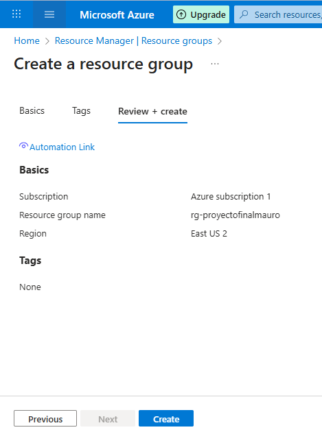


### 2️⃣. Creacion del storage account

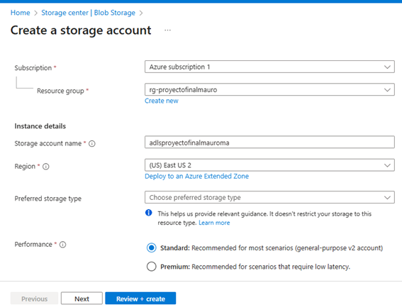

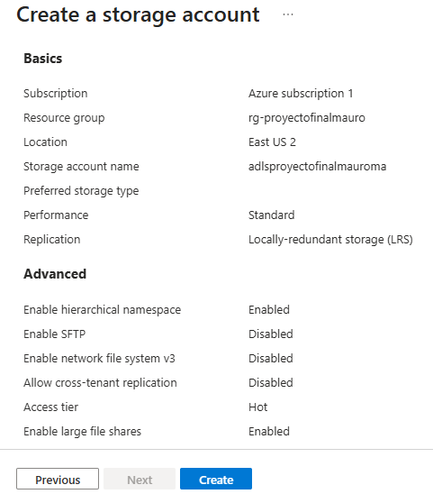


### 3️⃣. Creacion del access conector

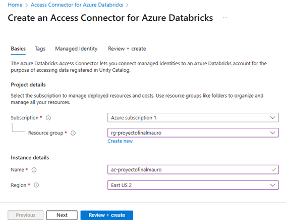


### 4️⃣. Add  role Assignment

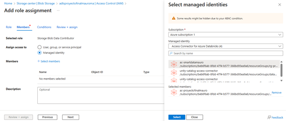

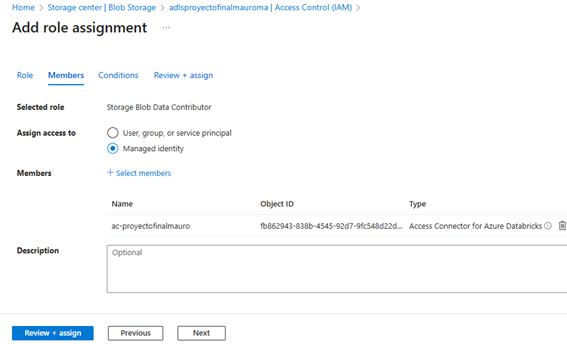


### 5️⃣. Containers


### 6️⃣. Creacion Azure databricks: produccion y desarrollo


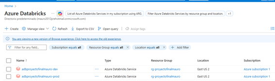


### 7️⃣. Creacion del cluster (en el databricks de desarrollo)

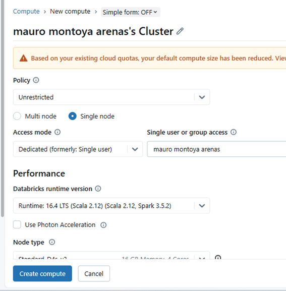


### 8️⃣. Creacion del metastore (cuenta EXT)

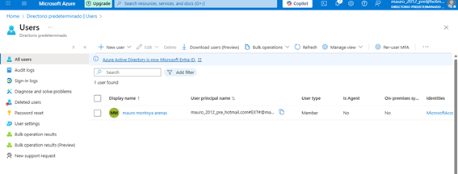

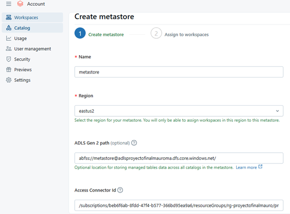


### 9️⃣. Creacion del repositorio en github


### 1️⃣0️⃣. Creacion del branch construccion

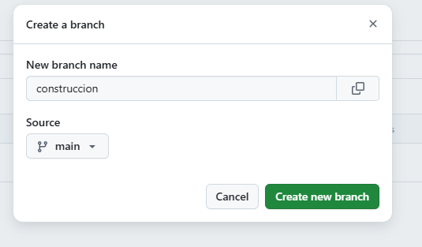


### 1️⃣1️⃣. Repositorio en el databricks de desarrollo


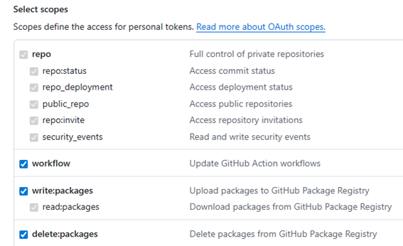


### 1️⃣2️⃣. Credencial Git


### 1️⃣3️⃣. Subida del archivo yaml al constructor


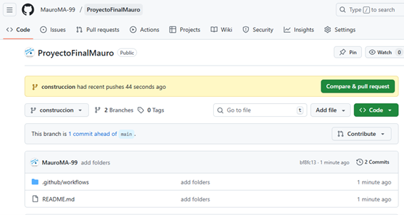


### 1️⃣4️⃣. Habilitacion delta sharing del metastore

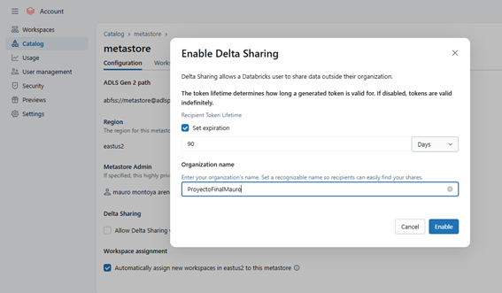


### 1️⃣5️⃣. App registration

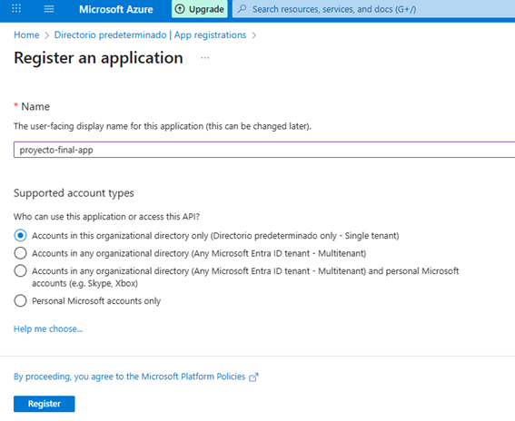

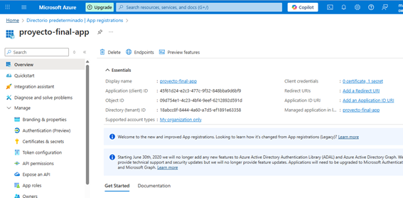

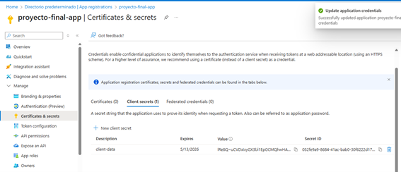


### 1️⃣6️⃣. Creacion del Key Vault


### 1️⃣7️⃣. Creacion del Secret Scope

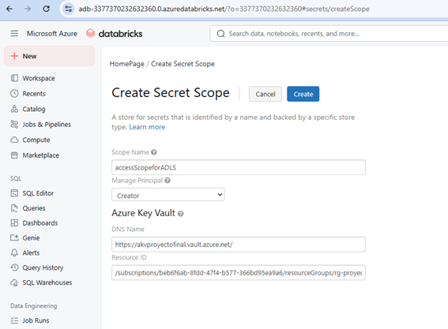


### 1️⃣8️⃣. Creacion de los Secrets del Host y Dest en Github

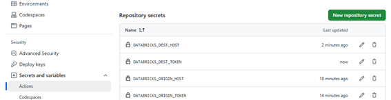

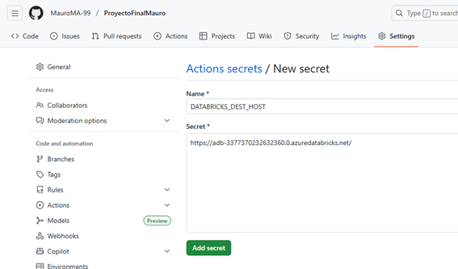


### 1️⃣9️⃣. Subida del script3 del yaml 

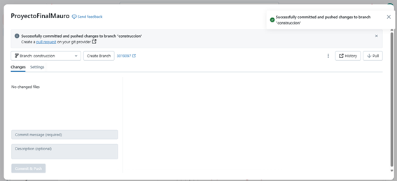


### 2️⃣0️⃣. Pull request: De construccion a main

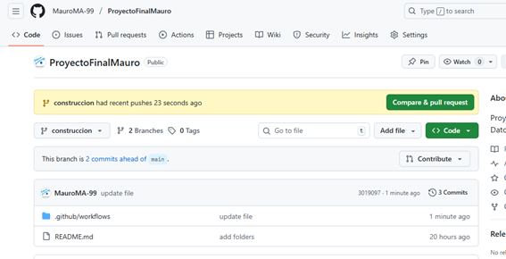

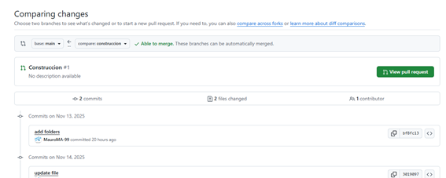

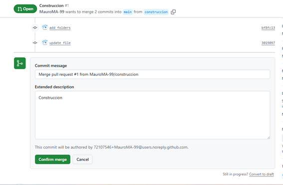

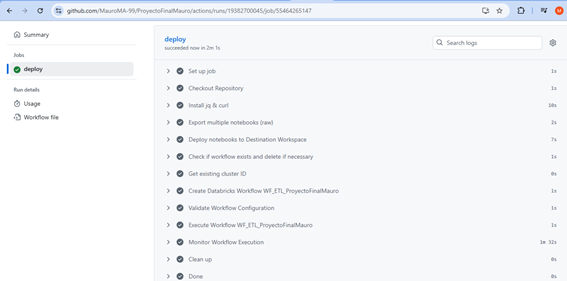

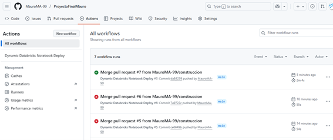


### 2️⃣1️⃣. Workflow en produccion


### 2️⃣2️⃣. Data Fuente para el Power BI

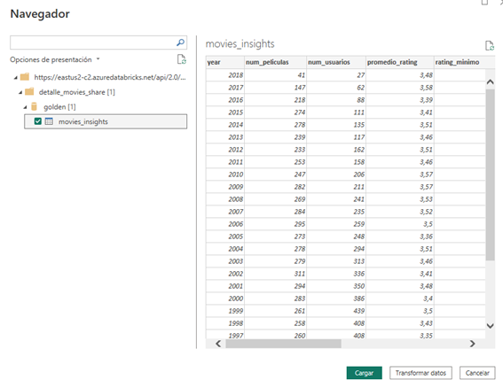


